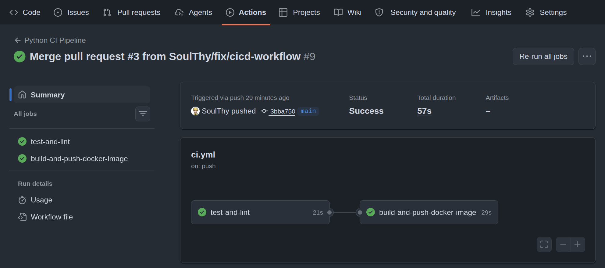
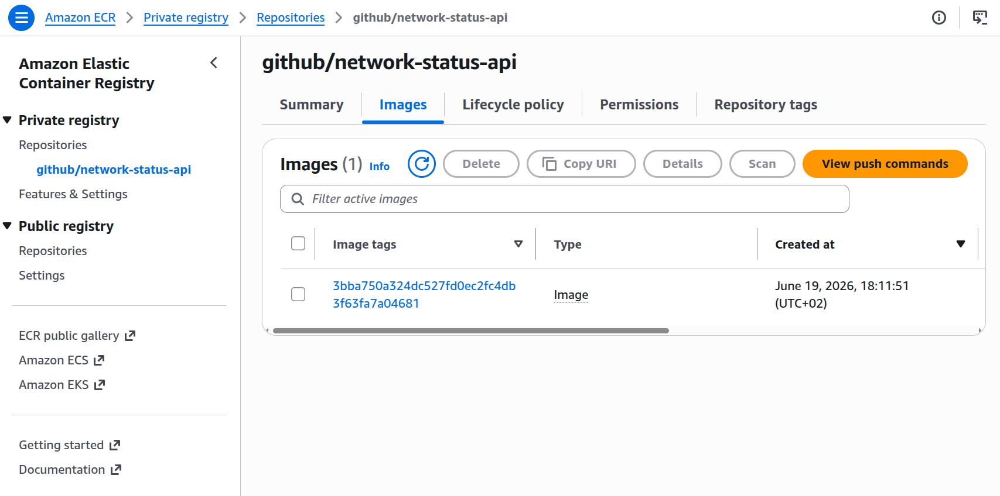

# network-status-api

[](https://github.com/SoulThy/network-status-api/actions/workflows/ci.yml)

A lightweight, minimal REST API built with FastAPI to track network device states, featuring validation and an automated CI/CD pipeline for continuous testing and quality assurance.

## CI/CD Pipeline & Cloud Infrastructure

This project implements a fully automated CI/CD pipeline using **GitHub Actions**, with integration to **AWS Elastic Container Registry (ECR)**. 

The pipeline ensures:
1. **Linting & Formatting:** code is checked and formatted using `ruff`.
2. **Testing:** automated integration tests are executed via `pytest`.
3. **Secure AWS Authentication:** the pipeline authenticates to AWS using **OIDC (OpenID Connect)** via an IAM Role.
4. **Containerization & Delivery:** Upon successful tests, a Docker image is built, tagged with the specific Git commit SHA, and pushed to Amazon ECR.

## Screenshots & Proof of Work
**Successful CI/CD Execution:**


**Docker Image securely pushed to Amazon ECR via OIDC:**


## Local Development

Enter the project directory:
```bash
cd network-status-api
```

Build the Docker container:
```bash
docker build -t network-status-api .
```

Run the container (e.g. exposing port 8000 to localhost):
```bash
docker run -p 8000:8000 network-status-api
```

## API Endpoints
### GET /
Returns a JSON object with a message indicating that the API is running.

### GET /devices
Returns a JSON array of valid device objects parsed from local storage, each with the following properties:

- id: a unique identifier for the device.

- name: the name of the device.

- type: the type of device (e.g., switch, router).

- ip: the IP address of the device.

- status: the current status of the device (e.g., on, off).

### PUT /devices/{device_id}
Updates or creates a device with the specified device_id. The request body must contain the device object properties.
